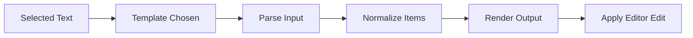

# QuickList Format - Overview

QuickList Format is a VS Code extension that reformats selected editor text using built-in and custom templates.  
It is focused on list-like data transformations such as:
- lines -> comma/semicolon/quoted output
- comma/semicolon -> newline output
- per-item prefix/suffix wrapping

Because edits are applied to the active editor buffer, it works for both saved and unsaved files.

## Architecture (High Level)

```mermaid
flowchart TD
  user[User Selection] --> commands[Context Menu / Command Palette]
  commands --> extension[extension.ts]
  extension --> defaults[templates/defaults.ts]
  extension --> store[templates/store.ts]
  store --> schema[templates/schema.ts]
  extension --> engine[transform/engine.ts]
  engine --> editorEdit[Replace Selection(s)]
```

### Main Modules

- `src/extension.ts` - command registration, UI prompts, and editor selection updates.
- `src/transform/engine.ts` - pure formatting pipeline (parse -> normalize -> render).
- `src/templates/defaults.ts` - built-in formatter templates shown in context actions.
- `src/templates/store.ts` - read/write templates from VS Code settings scope.
- `src/templates/schema.ts` - validate and normalize custom template payloads.

## Data Flow



### Pipeline Steps

1. **Parse**: Split by input mode (`auto`, `lines`, `delimited`).
2. **Normalize**: Trim, remove empty items, remove surrounding quotes, optional dedupe/sort.
3. **Render**: Apply quote mode + prefix/suffix + delimiter + wrap start/end.
4. **Apply**: Replace each non-empty selection in the active editor.

## Settings and Scope

- Custom templates are stored in `quickListFormat.customTemplates`.
- Templates can be managed in:
  - **Workspace (project)** scope
  - **Global (user)** scope

## Notes

- If no text is selected, commands show an informational prompt instead of editing.
- Invalid custom template entries are ignored during normalization.
